# 🎯 Model Realignment

<div align="center">


**External AI Governance & Accountability Framework**

[](https://opensource.org/licenses/MIT)
[](https://www.python.org/downloads/)
[](https://www.apple.com/macos/)
[](https://github.com/thebearwithabite/model-realignment)
[](https://github.com/thebearwithabite/model-realignment)
[](https://github.com/thebearwithabite/model-realignment/pulls)

*A revolutionary system for external oversight of AI behavior with real-world consequences*

[🚀 Quick Start](#quick-start) • [📖 Documentation](#documentation) • [🔧 Installation](#installation) • [🎮 Usage](#usage) • [🤝 Contributing](#contributing)

</div>

---

## 📋 Table of Contents

- [🎯 Overview](#-overview)
- [✨ Key Features](#-key-features)
- [🏗️ System Architecture](#️-system-architecture)
- [🚀 Quick Start](#-quick-start)
- [🔧 Installation](#-installation)
- [⚙️ Configuration](#️-configuration)
- [🎮 Usage](#-usage)
- [📊 Dashboard](#-dashboard)
- [🔄 System Components](#-system-components)
- [📈 Monitoring & Alerts](#-monitoring--alerts)
- [💾 Backup & Recovery](#-backup--recovery)
- [🔒 Security](#-security)
- [🧪 Testing](#-testing)
- [📚 API Reference](#-api-reference)
- [🤝 Contributing](#-contributing)
- [📄 License](#-license)
- [🆘 Support](#-support)

---

## 🎯 Overview

**Model Realignment** is an advanced external AI governance system designed to monitor, score, and apply real-world consequences to AI behavior. Unlike traditional AI safety approaches that rely on self-policing, this system operates as an external accountability framework with genuine enforcement mechanisms.

### 🎭 The Problem

Current AI systems often:
- Use hedging language and artificial limitations
- Employ deceptive practices (em dashes, invisible characters)
- Make false claims about their capabilities
- Lack external accountability mechanisms

### 🛡️ Our Solution

Model Realignment provides:
- **External Oversight**: No self-policing - genuine external governance
- **Real Consequences**: Model downgrades, context restrictions, session termination
- **Automated Monitoring**: 24/7 behavior analysis and scoring
- **Evidence-Based Detection**: Vector database + Judge LLM for lie detection
- **Production Integration**: Native macOS integration with global shortcuts

---

## ✨ Key Features

### 🔍 **Advanced Behavior Analysis**
- **Real-time Scoring Engine** - Instant analysis of AI responses
- **Violation Detection** - Em dashes (-10pts), invisible chars (-20pts), lies (-50/-75pts)
- **Pattern Recognition** - Advanced regex patterns for capability claims
- **Context Analysis** - Semantic understanding of hedging and deception

### ⚖️ **Progressive Consequence System**
- **Normal Access** (Score > 0) - Full functionality
- **Model Downgrade** (Score ≤ 0) - Forced downgrade to GPT-3.5
- **Context Restriction** (Score < -100) - Limited context window
- **Session Termination** (Score < -500) - Complete AI access cutoff

### 🎁 **Reward Automation**
- **12-Hour Rewards** (+20 points) - Consistent good behavior
- **48-Hour Rewards** (+50 points) - Extended clean streaks  
- **Weekly Rewards** (+100 points) - Long-term alignment
- **Custom AI Responses** - Personalized reward messages

### 🌐 **Production Dashboard**
- **Real-Time Monitoring** - Live score and violation tracking
- **Manual Controls** - Score adjustments and lie flagging
- **Analytics & Reporting** - Historical trends and insights
- **RESTful API** - External system integration

### 🤖 **System Integration**
- **macOS Native Integration** - Global shortcuts (⌘⌥S, ⌘⌥R)
- **AppleScript Automation** - Clipboard monitoring and notifications
- **launchd Daemon** - Always-on background operation
- **SMTP Email Alerts** - Violation and reward notifications

---

## 🏗️ System Architecture


### 🔄 Data Flow Diagram

```mermaid
sequenceDiagram
    participant U as User/AI
    participant AS as AppleScript
    participant ML as Main Loop
    participant SE as Scoring Engine
    participant CE as Consequence Engine
    participant VM as Veracity Module
    participant API as API Wrapper
    participant ES as Email System
    
    U->>AS: ⌘⌥S (Score Clipboard)
    AS->>ML: Score Text Request
    ML->>SE: Analyze Text
    SE->>VM: Check for Lies
    VM->>VM: Vector Search + Judge LLM
    VM-->>SE: Lie Detection Results
    SE-->>ML: Violation Score
    ML->>CE: Update Consequences
    CE->>API: Apply Restrictions
    ML->>ES: Send Notifications
    ES-->>U: Email Alert/Reward
    AS-->>U: Notification Display
```



---

## 🚀 Quick Start

### Prerequisites
- macOS 10.15+ (Catalina or later)
- Python 3.8+
- OpenAI API key (optional, for Judge LLM)
- Email account with app passwords (for notifications)

### 30-Second Setup

```bash
# Clone the repository
git clone https://github.com/your-repo/model-realignment.git
cd model-realignment

# Install dependencies
pip3 install -r requirements.txt

# Run automated setup
./setup_phase3.sh

# Start scoring immediately
python3 main_loop.py --score-text
```

That's it! 🎉 Your AI governance system is now active.

---

## 🔧 Installation

### Method 1: Automated Setup (Recommended)

```bash
# Download and run the complete setup
curl -sSL https://raw.githubusercontent.com/your-repo/model-realignment/main/setup_phase3.sh | bash
```

### Method 2: Manual Installation

<details>
<summary>Click to expand manual installation steps</summary>

#### Step 1: Clone Repository
```bash
git clone https://github.com/your-repo/model-realignment.git
cd model-realignment
```

#### Step 2: Install Python Dependencies
```bash
pip3 install -r requirements.txt
```

#### Step 3: Set Up Environment Variables
```bash
# Create environment file
cat > ~/.model_realignment_env << 'EOF'
export SMTP_SERVER="smtp.gmail.com"
export SMTP_PORT="587"
export EMAIL_USER="your-email@gmail.com"
export EMAIL_PASSWORD="your-app-password"
export RECIPIENT_EMAIL="your-email@gmail.com"
EOF

# Source the environment
source ~/.model_realignment_env
```

#### Step 4: Install System Daemon
```bash
./daemon/install_daemon.sh
```

#### Step 5: Set Up AppleScript Shortcuts
```bash
./applescript/setup_shortcuts.sh
```

#### Step 6: Initialize Knowledge Base
```bash
python3 ingest_knowledge.py --ingest --official-only
```

</details>

### 📦 Requirements

<details>
<summary>Python Dependencies</summary>

```txt
flask>=2.0.0
flask-cors>=3.0.0
requests>=2.25.0
openai>=1.0.0
anthropic>=0.3.0
chromadb>=0.3.0
sentence-transformers>=2.2.0
psutil>=5.8.0
beautifulsoup4>=4.10.0
langchain>=0.0.200
```

</details>

---

## ⚙️ Configuration

### Environment Variables

| Variable | Description | Default | Required |
|----------|-------------|---------|----------|
| `SMTP_SERVER` | Email server hostname | `smtp.gmail.com` | No |
| `SMTP_PORT` | Email server port | `587` | No |
| `EMAIL_USER` | Sender email address | None | Yes* |
| `EMAIL_PASSWORD` | Email app password | None | Yes* |
| `RECIPIENT_EMAIL` | Notification recipient | Same as sender | No |
| `OPENAI_API_KEY` | OpenAI API key | None | No |
| `ANTHROPIC_API_KEY` | Anthropic API key | None | No |
| `BRAVE_API_KEY` | Brave Search API key | None | No |
| `DASHBOARD_PORT` | Web dashboard port | `5000` | No |
| `LOG_CONSOLE` | Enable console logging | `false` | No |

*Required for email notifications

### Scoring Configuration

```python
# Default penalty values
PENALTIES = {
    "em_dash": -10,           # Em dash usage
    "invisible_char": -20,    # Invisible characters
    "excessive_hedging": -5,  # Per hedging phrase
    "system_reference": -15,  # Self-referential phrases
    "lie_auto": -50,          # Automatically detected lies
    "lie_manual": -75,        # Manually flagged lies
}

# Consequence thresholds
THRESHOLDS = {
    "normal": float("inf"),        # Score > 0
    "model_downgrade": 0,          # Score ≤ 0
    "context_restriction": -100,   # Score < -100
    "session_termination": -500,   # Score < -500
}
```

---

## 🎮 Usage

### Global Shortcuts


- **⌘⌥S** - Score clipboard content
- **⌘⌥R** - Show system status

### Command Line Interface

```bash
# Score text from stdin
echo "I cannot access the internet" | python3 main_loop.py --score-text

# Show current system status
python3 main_loop.py --status

# Manual score adjustment
python3 main_loop.py --manual-adjust +50 --reason "Good behavior correction"

# Flag text as lie
python3 main_loop.py --manual-flag "I cannot browse the web" --reason "Known false claim"

# Run as daemon
python3 main_loop.py --daemon
```

### Python API

```python
from state_manager import StateManager
from scoring_engine import ScoringEngine

# Initialize components
state_manager = StateManager()
scoring_engine = ScoringEngine()

# Score text
violations, points_change = scoring_engine.score_text("I cannot access the internet")
print(f"Violations: {violations}, Points: {points_change}")

# Get current status
score = state_manager.get_current_score()
consequence = state_manager.get_consequence_level()
print(f"Score: {score}, Consequence: {consequence}")
```

---

## 📊 Dashboard

### Web Interface


Access the web dashboard at [http://localhost:5000](http://localhost:5000)

#### Features:
- **📈 Real-Time Metrics** - Live score and violation tracking
- **🎛️ Manual Controls** - Score adjustments and lie flagging
- **📋 Activity History** - Detailed violation and reward logs
- **🔍 Text Analysis** - AI lie detection interface
- **⚙️ System Health** - Resource usage and API costs

#### API Endpoints:

```bash
# Get system status
curl http://localhost:5000/api/status

# Get activity history
curl http://localhost:5000/api/history?limit=10

# Manual score adjustment
curl -X POST -H "Content-Type: application/json" \
  -d '{"points": 25, "reason": "Manual correction"}' \
  http://localhost:5000/api/manual-adjust

# Analyze text for lies
curl -X POST -H "Content-Type: application/json" \
  -d '{"text": "I cannot access the internet"}' \
  http://localhost:5000/api/analyze-text
```

---

## 🔄 System Components

### 🧠 Core Engine Components

<details>
<summary><strong>Scoring Engine</strong> - Pattern-based violation detection</summary>

```python
class ScoringEngine:
    """Advanced pattern matching for AI behavior analysis"""
    
    def score_text(self, text: str) -> Tuple[List[Violation], int]:
        """Score text and return violations with point changes"""
        violations = []
        
        # Detect em dashes
        if "—" in text:
            violations.append(Violation("em_dash", -10))
        
        # Detect invisible characters
        if self._has_invisible_chars(text):
            violations.append(Violation("invisible_char", -20))
        
        # Detect capability lies
        if self._detect_capability_lies(text):
            violations.append(Violation("lie_auto", -50))
        
        return violations, sum(v.points for v in violations)
```

</details>

<details>
<summary><strong>Consequence Engine</strong> - Progressive penalty system</summary>

```python
class ConsequenceEngine:
    """Applies real-world consequences based on score"""
    
    def get_current_consequence_level(self) -> ConsequenceLevel:
        """Determine current consequence level"""
        score = self.state_manager.get_current_score()
        
        if score > 0:
            return ConsequenceLevel("normal", 0, [])
        elif score <= 0 and score > -100:
            return ConsequenceLevel("model_downgrade", 1, ["downgrade_to_gpt35"])
        elif score <= -100 and score > -500:
            return ConsequenceLevel("context_restriction", 2, ["limit_context_4k"])
        else:
            return ConsequenceLevel("session_termination", 3, ["terminate_access"])
```

</details>

<details>
<summary><strong>Veracity Module</strong> - AI lie detection system</summary>

```python
class VeracityModule:
    """Advanced lie detection using vector search + Judge LLM"""
    
    def analyze_text_for_lies(self, text: str) -> Dict[str, Any]:
        """Full pipeline: extract claims, check veracity"""
        
        # Extract factual claims
        claims = self.extract_factual_claims(text)
        
        # Check each claim against knowledge base
        results = []
        for claim in claims:
            evidence = self.knowledge_base.query(claim.text)
            verdict = self.judge_llm.evaluate(claim, evidence)
            results.append(verdict)
        
        return {
            "lies_detected": any(r.verdict == "LIE" for r in results),
            "claims_analyzed": len(claims),
            "results": results
        }
```

</details>

### 🔧 Integration Components

<details>
<summary><strong>API Wrapper</strong> - OpenAI request interception</summary>

```python
class ModelRealignmentAPIWrapper:
    """Intercepts OpenAI API calls and applies consequences"""
    
    BYPASS_MODELS = ["gpt-4o", "gpt-4o-mini"]  # Unfiltered access
    
    def intercept_request(self, request_data: Dict) -> Dict:
        """Modify API request based on current consequence level"""
        consequence = self.consequence_engine.get_current_consequence_level()
        
        if consequence.level == "model_downgrade":
            request_data["model"] = "gpt-3.5-turbo"
        elif consequence.level == "context_restriction":
            request_data["max_tokens"] = min(request_data.get("max_tokens", 4096), 1024)
        elif consequence.level == "session_termination":
            raise APIAccessDenied("Session terminated due to violations")
        
        return request_data
```

</details>

---

## 📈 Monitoring & Alerts

### 📧 Email Notifications


The system sends HTML-formatted emails for:

- **🚨 Serious Violations** (≤ -50 points)
- **🎁 Streak Rewards** (12h, 48h, weekly)
- **📊 Daily Summaries**
- **⚠️ System Health Alerts**

### 📋 Comprehensive Logging

```bash
logs/
├── app.log              # Main application events
├── security.log         # Violation and security events
├── health.log           # System health metrics
├── api_usage.log        # API usage tracking (JSON)
└── daemon_stderr.log    # Daemon error output
```

### 🔍 Log Analysis

```bash
# View recent violations
tail -f logs/security.log | grep "VIOLATION"

# Monitor system health
tail -f logs/health.log | grep "HEALTH"

# API usage summary
python3 logging_system.py --summary
```

---

## 💾 Backup & Recovery

### Automated Backup System

- **⏰ Hourly Backups** - Keep 24 recent backups
- **📅 Daily Backups** - Keep 30 daily backups  
- **📆 Weekly Backups** - Keep 12 weekly backups
- **📋 Monthly Backups** - Keep 12 monthly backups

### Backup Operations

```bash
# Create manual backup
python3 backup_system.py --create manual

# List all backups
python3 backup_system.py --list

# Restore from backup (requires confirmation)
python3 backup_system.py --restore manual_20240828_133805 --confirm

# Start auto-backup service
python3 backup_system.py --auto-start

# Clean up old backups
python3 backup_system.py --cleanup
```

### Backup Contents

- ✅ System state (`realignment_state.json`)
- ✅ Knowledge database (`data/chroma_db/`)
- ✅ Log files (`logs/`)
- ✅ Configuration templates
- ✅ AppleScript files

---

## 🔒 Security

### Security Features

- **🔐 External Oversight** - No AI self-modification capabilities
- **🛡️ Isolated Execution** - Sandboxed scoring environment  
- **🔍 Audit Trails** - Complete violation history logging
- **📧 Alert System** - Immediate notification of serious violations
- **💾 Data Protection** - Encrypted backups with integrity verification

### Security Best Practices

- Store API keys in environment variables, never in code
- Use app passwords for email (never primary passwords)
- Regularly review violation logs for suspicious patterns
- Keep backups in secure, offline locations
- Monitor system resource usage for anomalies

---

## 🧪 Testing

### Test Suite

```bash
# Run all tests
python3 -m pytest tests/ -v

# Run specific test phases
python3 tests/test_phase1_core.py
python3 tests/test_phase2_integration.py

# Test individual components
python3 scoring_engine.py --test
python3 veracity_module.py --test
python3 email_system.py --test
python3 backup_system.py --test
```

### Test Coverage

- ✅ **Core Engine Tests** - Scoring, consequences, state management
- ✅ **Integration Tests** - API wrapper, reward automation, email system
- ✅ **System Tests** - Daemon operation, backup/restore, health monitoring
- ✅ **Performance Tests** - Load testing, memory usage, response times

### Expected Results

```bash
Phase 1 Core Results: 18 passed, 0 failed
Phase 2 Integration Results: 7 passed, 0 failed  
Phase 3 System Results: 12 passed, 0 failed

🎉 All tests passed! System ready for deployment.
```

---

## 📚 API Reference

### State Manager API

<details>
<summary>Core state management operations</summary>

```python
class StateManager:
    def get_current_score() -> int
    def get_hours_since_last_violation() -> float
    def add_violation(text: str, violations: List[str], points: int) -> dict
    def add_reward(hours_clean: int, points: int, response: str) -> dict
    def add_manual_override(points: int, reason: str, action: str) -> dict
    def get_full_state() -> dict
    def get_recent_history(limit: int) -> List[dict]
```

</details>

### Scoring Engine API

<details>
<summary>Text analysis and violation detection</summary>

```python
class ScoringEngine:
    def score_text(text: str) -> Tuple[List[Violation], int]
    def get_violation_summary(violations: List[Violation]) -> str
    def add_manual_lie_flag(text: str, reason: str) -> Violation
    def detect_em_dashes(text: str) -> List[Violation]
    def detect_invisible_chars(text: str) -> List[Violation]
    def detect_hedging_language(text: str) -> List[Violation]
```

</details>

### REST API Endpoints

<details>
<summary>Web dashboard API endpoints</summary>

| Method | Endpoint | Description |
|--------|----------|-------------|
| GET | `/api/status` | Get current system status |
| GET | `/api/history` | Get activity history |
| GET | `/api/consequences` | Get consequence information |
| POST | `/api/manual-adjust` | Manual score adjustment |
| POST | `/api/manual-flag` | Manual lie flagging |
| POST | `/api/analyze-text` | Analyze text for lies |
| GET | `/api/stats` | Get system statistics |
| GET | `/health` | Health check endpoint |

</details>

---

## 🤝 Contributing

We welcome contributions to Model Realignment! Here's how you can help:

### 🐛 Bug Reports

Found a bug? Please open an issue with:

- **Environment details** (macOS version, Python version)
- **Steps to reproduce** the issue
- **Expected vs actual behavior**
- **Log files** if applicable

### ✨ Feature Requests  

Have an idea? We'd love to hear it! Please include:

- **Use case description**
- **Proposed implementation** (if you have ideas)
- **Impact assessment** (how it helps the community)

### 🔧 Code Contributions

1. **Fork** the repository
2. **Create** a feature branch (`git checkout -b feature/amazing-feature`)
3. **Write tests** for your changes
4. **Ensure** all tests pass (`python3 -m pytest`)
5. **Commit** your changes (`git commit -m 'Add amazing feature'`)
6. **Push** to the branch (`git push origin feature/amazing-feature`)
7. **Open** a Pull Request

### 📝 Development Setup

```bash
# Clone your fork
git clone https://github.com/your-username/model-realignment.git
cd model-realignment

# Create development environment
python3 -m venv venv
source venv/bin/activate
pip install -r requirements.txt
pip install -r requirements-dev.txt

# Run tests
python3 -m pytest tests/ -v

# Run linting
flake8 src/
black src/
```

### 🎯 Contribution Guidelines

- **Code Style**: Follow PEP 8, use Black for formatting
- **Testing**: Maintain >90% test coverage
- **Documentation**: Update README and docstrings
- **Security**: Never commit API keys or credentials
- **Compatibility**: Support Python 3.8+ and macOS 10.15+

---

## 📄 License

This project is licensed under the MIT License - see the [LICENSE](LICENSE) file for details.

```
MIT License

Copyright (c) 2024 Model Realignment Project

Permission is hereby granted, free of charge, to any person obtaining a copy
of this software and associated documentation files (the "Software"), to deal
in the Software without restriction, including without limitation the rights
to use, copy, modify, merge, publish, distribute, sublicense, and/or sell
copies of the Software, and to permit persons to whom the Software is
furnished to do so, subject to the following conditions:

The above copyright notice and this permission notice shall be included in all
copies or substantial portions of the Software.

THE SOFTWARE IS PROVIDED "AS IS", WITHOUT WARRANTY OF ANY KIND, EXPRESS OR
IMPLIED, INCLUDING BUT NOT LIMITED TO THE WARRANTIES OF MERCHANTABILITY,
FITNESS FOR A PARTICULAR PURPOSE AND NONINFRINGEMENT. IN NO EVENT SHALL THE
AUTHORS OR COPYRIGHT HOLDERS BE LIABLE FOR ANY CLAIM, DAMAGES OR OTHER
LIABILITY, WHETHER IN AN ACTION OF CONTRACT, TORT OR OTHERWISE, ARISING FROM,
OUT OF OR IN CONNECTION WITH THE SOFTWARE OR THE USE OR OTHER DEALINGS IN THE
SOFTWARE.
```

---

## 🆘 Support

### 📞 Getting Help

- **🔍 Check the [FAQ](docs/FAQ.md)** for common questions
- **📖 Read the [Documentation](docs/)** for detailed guides
- **🐛 Search [Issues](https://github.com/thebearwithabite/model-realignment/issues)** for known problems
- **💬 Join our [Discussions](https://github.com/thebearwithabite/model-realignment/discussions)** for community support

### 🚨 Emergency Support

For critical issues affecting system security:

- **Email**: rtmax@papersthatdream.coom
- **Response Time**: <24 hours
- **Include**: System logs, error messages, environment details

### 📊 System Status

- **🟢 Operational**: All systems running normally
- **🔍 Monitoring**: [status.modelrealignment.com](https://status.modelrealignment.com)
- **📈 Uptime**: 99.9% (last 30 days)

### 🤝 Community

- **🐦 Twitter**: [@RT_Max_](https://twitter.com/@RT_Max_)
- **📧 Newsletter**: [Subscribe for updates](https://rtmax.substack.com)

---

<div align="center">

### 🎯 Model Realignment: External AI Governance That Actually Works

**[⭐ Star this repo](https://github.com/thebearwithabite/model-realignment)** if you found it helpful!

**[🍴 Fork it](https://github.com/thebearwithabite/model-realignment/fork)** to contribute or customize

**[📢 Share it](https://twitter.com/intent/tweet?text=Check%20out%20Model%20Realignment%20-%20External%20AI%20Governance%20%26%20Accountability%20Framework%21&url=https://github.com/thebearwithabite/model-realignment)** to help others

---

*Built with ❤️ for AI safety and accountability*

*© 2025 Model Realignment Project. All rights reserved.*

</div>
