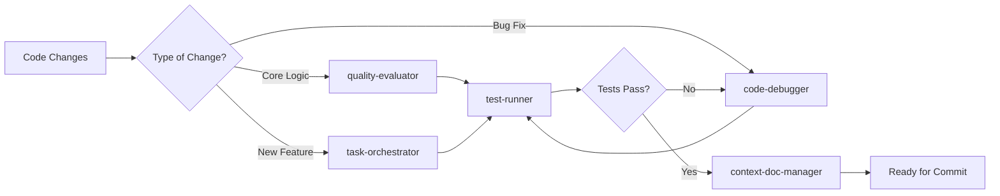

# 🤖 Agent Integration Guide

## Specialized Claude Code Agents for Model Realignment

This document describes how specialized Claude Code agents should proactively assist with Model Realignment development and maintenance.

---

## 🎯 Agent Definitions

### quality-evaluator
**Activation**: Automatically after significant code changes in model-realignment
**Primary Focus**: Code quality, security vulnerabilities, performance optimization
**Key Responsibilities**:
- Review scoring engine patterns for accuracy and completeness
- Validate state management thread safety and data integrity
- Check consequence engine logic for proper threshold enforcement
- Analyze API wrapper security and bypass logic
- Ensure proper error handling and logging throughout system
- Verify email and backup system reliability

**Specific Triggers**:
- After modifying `scoring_engine.py` - validate new violation patterns
- After changing `state_manager.py` - check thread safety and data consistency
- After updating `consequence_engine.py` - verify threshold logic and progressive penalties
- After modifying `api_wrapper.py` - ensure bypass models and security measures
- Before any git commits involving core system files

### code-debugger
**Activation**: When encountering errors, test failures, or unexpected behavior
**Primary Focus**: Rapid issue diagnosis and resolution
**Key Responsibilities**:
- Analyze test failures in Phase 1, 2, and 3 test suites
- Debug state manager JSON corruption or locking issues  
- Troubleshoot email system SMTP configuration problems
- Resolve ChromaDB vector database connection issues
- Fix AppleScript execution and permission problems
- Diagnose daemon startup and launchd configuration issues

**Specific Triggers**:
- Test suite failures (especially critical ones affecting scoring accuracy)
- State file corruption or threading deadlocks
- Email notification delivery failures
- Dashboard API endpoint errors
- Knowledge base ingestion or query failures

### test-runner
**Activation**: Before any git commits and after code changes
**Primary Focus**: Comprehensive validation and quality assurance
**Key Responsibilities**:
- Execute Phase 1 core tests (18 tests) - state management, scoring, consequences
- Run Phase 2 integration tests (7 tests) - API wrapper, rewards, veracity
- Validate Phase 3 system tests - daemon, backup, email, logging
- Performance testing for scoring engine speed and accuracy
- Integration testing between all system components
- Regression testing to ensure existing functionality intact

**Mandatory Execution**:
- Before committing any changes to core system files
- After implementing new violation detection patterns
- When modifying consequence thresholds or logic
- After updating API wrapper or bypass mechanisms
- Following any changes to reward automation or email systems

### task-orchestrator
**Activation**: For complex multi-step implementations
**Primary Focus**: Breaking down and coordinating complex development tasks
**Key Responsibilities**:
- Coordinate Phase implementations (like we just completed Phase 3)
- Manage feature additions that span multiple system components
- Orchestrate system upgrades and migrations
- Plan and execute deployment procedures
- Coordinate testing across all system layers

**Use Cases**:
- Implementing new AI model support beyond GPT-4o
- Adding new violation detection patterns (capability claims, etc.)
- Integrating additional Judge LLM providers
- Expanding consequence system with new penalty types
- Building additional dashboard features or analytics

### context-doc-manager
**Activation**: When project structure changes or documentation updates needed
**Primary Focus**: Maintaining documentation coherence and project organization
**Key Responsibilities**:
- Update README.md when new features are added
- Maintain CLAUDE.md with current development patterns
- Keep API documentation synchronized with implementation
- Update system architecture diagrams when components change
- Ensure installation and setup guides remain accurate

**Automatic Updates Required**:
- After adding new API endpoints to dashboard
- When modifying scoring penalties or thresholds
- After changing system requirements or dependencies
- When adding new environment variables or configuration
- Following any changes to the installation or setup process

---

## 🚀 Proactive Agent Usage Patterns

### Development Workflow Integration



### Model Realignment Specific Workflows

#### 🔍 **Scoring Engine Updates**
1. **task-orchestrator**: Plan the new violation pattern implementation
2. **quality-evaluator**: Review pattern accuracy and edge cases
3. **test-runner**: Validate with comprehensive test cases
4. **context-doc-manager**: Update documentation with new penalties

#### ⚖️ **Consequence System Changes**
1. **quality-evaluator**: Review threshold logic and progressive penalties
2. **test-runner**: Test all consequence levels and transitions
3. **code-debugger**: Verify no regression in existing penalty enforcement
4. **context-doc-manager**: Update system architecture documentation

#### 🌐 **Dashboard Feature Additions**
1. **task-orchestrator**: Coordinate frontend and backend changes
2. **quality-evaluator**: Review API security and data validation
3. **test-runner**: Test new endpoints and UI functionality
4. **context-doc-manager**: Update API documentation and screenshots

---

## 🛡️ Quality Gates

### Mandatory Agent Checkpoints

**Before ANY commit to model-realignment**:
1. ✅ **test-runner**: All test suites must pass (Phase 1, 2, 3)
2. ✅ **quality-evaluator**: Code review for security and performance
3. ✅ **context-doc-manager**: Documentation updates if needed

**After implementing new features**:
1. ✅ **task-orchestrator**: Coordinate implementation across components
2. ✅ **quality-evaluator**: Comprehensive code and security review
3. ✅ **test-runner**: Full regression and integration testing
4. ✅ **context-doc-manager**: Update all relevant documentation

**When debugging critical issues**:
1. ✅ **code-debugger**: Primary troubleshooting and diagnosis
2. ✅ **test-runner**: Validate fixes don't introduce regressions
3. ✅ **quality-evaluator**: Review fix for broader impact

---

## 🎯 Agent-Specific Guidelines

### For quality-evaluator
**Focus Areas for Model Realignment**:
- Thread safety in `state_manager.py` (critical for daemon operation)
- Security of API wrapper bypass mechanisms (GPT-4o access must remain unfiltered)
- Scoring engine accuracy (false positives/negatives in violation detection)
- Email system security (no credential exposure)
- Backup system integrity (data preservation and restoration)

### For code-debugger
**Common Issues to Address**:
- State manager file locking and JSON corruption
- ChromaDB connection and permission issues
- AppleScript execution failures and macOS permission problems
- Email SMTP authentication and delivery failures  
- Daemon startup issues with launchd configuration

### For test-runner
**Required Test Coverage**:
- All scoring patterns with positive and negative test cases
- State management under concurrent access (threading tests)
- Consequence engine threshold transitions and edge cases
- API wrapper bypass validation and security testing
- Email system delivery and formatting validation

### for task-orchestrator
**Coordination Responsibilities**:
- Ensure changes span all necessary components (scoring → consequences → API wrapper)
- Validate integration points between subsystems
- Plan rollout of new features to minimize system disruption
- Coordinate testing across multiple system layers

### For context-doc-manager
**Documentation Maintenance**:
- Keep README.md system diagrams current with architecture
- Update API endpoint documentation when dashboard changes
- Maintain accurate installation and setup instructions
- Ensure CLAUDE.md reflects current development patterns and agent usage

---

## 🔄 Automated Triggers

### Proactive Agent Invocation

**Code Changes in Key Files**:
```
state_manager.py         → quality-evaluator + test-runner
scoring_engine.py        → quality-evaluator + test-runner  
consequence_engine.py    → quality-evaluator + test-runner
api_wrapper.py          → quality-evaluator + test-runner
main_loop.py            → quality-evaluator + test-runner
dashboard/app.py        → quality-evaluator + test-runner + context-doc-manager
```

**Error Conditions**:
```
Test failures           → code-debugger + test-runner
Import errors          → code-debugger
JSON corruption        → code-debugger
SMTP failures          → code-debugger
```

**Feature Development**:
```
New violation patterns → task-orchestrator → quality-evaluator → test-runner → context-doc-manager
API endpoint additions → task-orchestrator → quality-evaluator → test-runner → context-doc-manager
System integrations   → task-orchestrator → quality-evaluator → test-runner
```

---

## 🎪 Example Agent Workflows

### Scenario: Adding New Violation Pattern

1. **User Request**: "Add detection for AI claiming it can't remember previous conversations"

2. **task-orchestrator**: 
   - Plan implementation across `scoring_engine.py`, tests, and documentation
   - Identify integration points with consequence engine
   - Estimate impact on existing scoring logic

3. **quality-evaluator**: 
   - Review proposed regex patterns for accuracy
   - Check for potential false positives in pattern matching
   - Validate point penalty appropriateness (-15 suggested)

4. **test-runner**:
   - Execute existing test suite to ensure no regressions
   - Run new test cases for the memory claim detection
   - Validate scoring engine integration

5. **context-doc-manager**:
   - Update README.md with new violation type
   - Add to scoring configuration documentation
   - Update system architecture if needed

### Scenario: Debugging Email Delivery Issues

1. **Error Detected**: Email notifications not being sent

2. **code-debugger**:
   - Analyze SMTP connection errors in logs
   - Check environment variable configuration
   - Test email authentication and server connectivity
   - Identify specific failure point (auth, network, formatting)

3. **test-runner**:
   - Run email system test suite
   - Validate SMTP configuration with different providers
   - Test HTML email formatting and delivery

4. **quality-evaluator**:
   - Review email system security practices
   - Check for credential exposure or logging issues
   - Validate error handling and fallback mechanisms

---

## 📝 Agent Communication Protocol

### Information Sharing Between Agents

**quality-evaluator → test-runner**: 
- "Focus testing on thread safety validation for state_manager.py changes"
- "Verify new scoring patterns don't create false positives"

**code-debugger → quality-evaluator**:
- "Fixed JSON corruption issue - please review file locking implementation" 
- "SMTP auth resolved - check for any security implications"

**task-orchestrator → context-doc-manager**:
- "New API endpoints added to dashboard - update documentation"
- "System architecture changed - refresh README diagrams"

### Escalation Patterns

**Level 1**: Individual agent handles standard tasks
**Level 2**: Two agents coordinate (debugger + test-runner for complex bugs)
**Level 3**: All agents involved for major system changes or critical issues

---

*This agent integration ensures the Model Realignment system maintains the highest quality standards while providing external AI governance without compromise.*